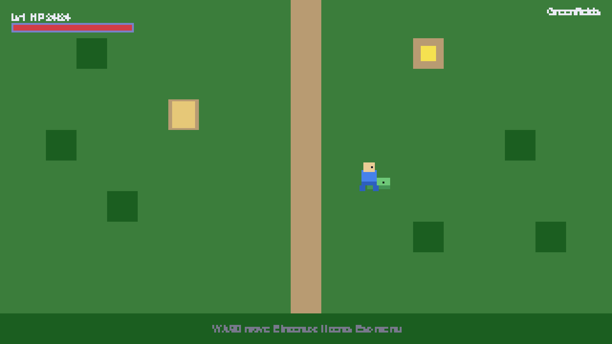
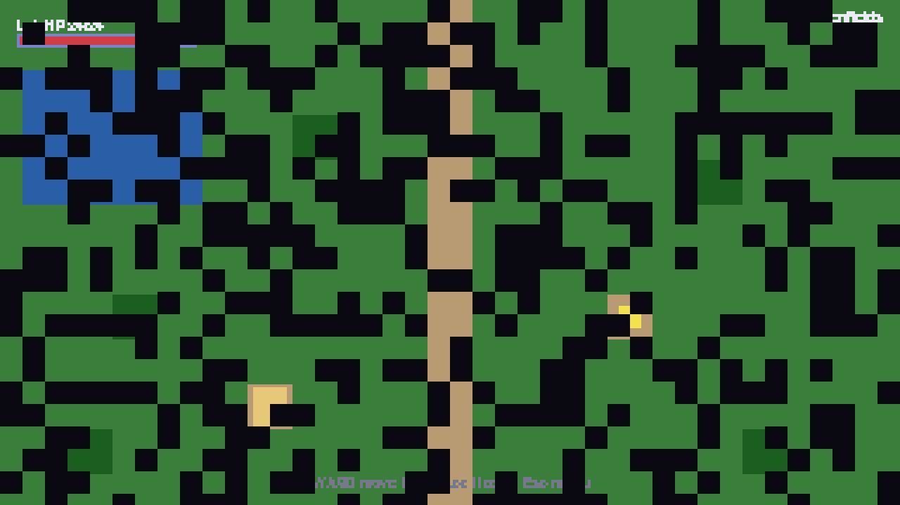
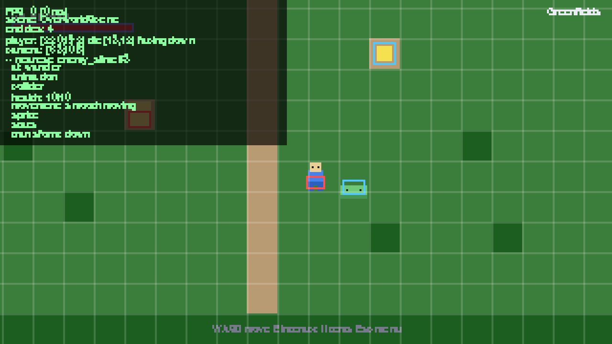

# 2D RPG Engine

A flexible, **data-driven**, **component-based**, **configurable** foundation for
building 2D RPGs in Python + Pygame. This is **not a single game** — it is a
reusable engine you customize into many different games (top-down adventure,
dungeon crawler, story RPG, …) mostly by **editing data and art, not engine code**.

It ships with a small but **complete playable demo** that exercises every system:
two connected maps with a portal between them, a walkable player, an NPC with
branching dialogue, a pick-up item, an enemy with a turn-based battle, working
save/load, and title + pause + inventory menus.

| Overworld (animated) | Pixel-dissolve transition | Debug overlay (F1) |
|---|---|---|
|  |  |  |

*(Gen 2 art is imported from Aseprite-format exports generated by
`tools/gen_demo_art.py`; an entity with no animation still falls back to a
coloured square, so a simple game needs no art at all.)*

---

## Table of contents

1. [Design principles](#design-principles)
2. [Quick start](#quick-start)
3. [Controls](#controls)
4. [Project structure](#project-structure)
5. [Architecture](#architecture)
6. [Configuration reference](#configuration-reference) — every option documented
7. [Making a new game](#making-a-new-game) — add a map, entity, item, scene; scale up
8. [Extending the graphics](#extending-the-graphics) — the advanced-render hooks
9. [Testing](#testing)
10. [Dependencies](#dependencies)

---

## Design principles

The engine is built around three rules from the ground up:

1. **Data-driven.** Maps, entities, items, dialogue and stats live in external
   JSON (`data/`), not in code. A new game is mostly new data + art.
2. **Composition over inheritance.** Entities are an id + a bag of *components*
   (Transform, Sprite, Health, AI, …). *Systems* hold the behaviour. You build
   new things by **mixing components in data**, never by subclassing.
3. **Nothing hardcoded you might want to change.** Every tunable — resolution,
   tile size, world size, speeds, colours, key bindings, layer order, combat
   numbers — comes from one documented config (`config/config.json`) read through
   a single `Settings` module. There are no magic numbers buried in code.

Two more requirements shape the whole design:

- **Graphics are upgradable.** Resolution-independent rendering (a base
  resolution scaled cleanly to any window), config-driven tile size & sprite
  scale, a renderer hidden behind an interface, a configurable layered draw
  order, and clearly-marked **extension hooks** for lighting / particles /
  shaders / post-processing.
- **World size is upgradable.** Maps are any size, loaded from data; a world is
  **many maps** connected by portals; and there is a clean **chunk-streaming
  stub** for very large worlds later.

---

## Quick start

```bash
# 1. Install the one dependency (pygame).
pip install -r requirements.txt

# 2. Run the demo.
python main.py
```

Use a different config without touching code:

```bash
RPG_CONFIG=config/my_config.json python main.py
```

> **Headless machines / CI:** the engine runs without a display for testing via
> SDL's dummy drivers:
> `SDL_VIDEODRIVER=dummy SDL_AUDIODRIVER=dummy python tests/test_smoke.py`

---

## Controls

All bindings are config (`input.bindings`) and fully remappable. Defaults:

| Action | Keys | What it does |
|---|---|---|
| Move | `WASD` / Arrows | Walk |
| Run | `Shift` | Move faster |
| Interact / Confirm | `E` / `Enter` / `Space` | Talk, pick up, advance dialogue, confirm menus |
| Attack | `J` / `X` / `K` | Melee swing (only in `combat.style = "action"`) |
| Cancel | `Esc` / `Backspace` | Back out of menus / dialogue |
| Menu | `Esc` | Open pause menu |
| Inventory | `I` / `Tab` | Open inventory |
| Quick save / load | `F5` / `F9` | Save to / load slot 1 |
| Debug overlay | `F1` | FPS, entity inspector, collider boxes, tile grid |

**Demo loop to try:** walk onto the yellow item (auto-pickup) → talk to the
villager (`E`) and pick dialogue options → bump the green slime to start a battle
→ win, then walk up the dirt path through the gap in the trees to warp into the
cave → `F5` to save, `Esc` for the pause menu.

---

## Project structure

```
2d-rpg-engine/
├── main.py                 # Demo entry point: build services, register scenes, run
├── config/
│   └── config.json         # THE central config (every tunable lives here)
├── engine/                 # REUSABLE engine. Copy this whole folder into a new project.
│   ├── settings.py         # Config access (dotted get, deep-merge overrides)
│   ├── core/               # game loop, scene/state stack, event bus
│   ├── ecs/                # entity / component / system model
│   │   ├── components/      # transform, sprite, movement, collider, health, ai, ...
│   │   └── systems/         # player controller, ai, movement(+collision), render
│   ├── graphics/           # renderer (resolution-independent), camera, effect hooks
│   ├── map/                # Tiled loader, TileMap, multi-map WorldMap, chunk stub
│   ├── assets/             # caching asset manager (+ auto placeholder art)
│   ├── input/              # remappable, config-driven input
│   ├── ui/                 # style, panel, menu, dialogue box, health bar, text wrap
│   ├── dialogue/           # branching dialogue state machine
│   ├── inventory/          # item database + inventory (use/equip)
│   ├── combat/             # abstract CombatSystem + turn-based example
│   ├── save/               # slot save manager + generic ECS serialization
│   └── utils/              # geometry, logging
├── game/                   # THE DEMO GAME (specific). Rewrite this for a new game.
│   ├── state.py            # shared/persistent GameState (what gets saved)
│   ├── factories/          # entity factory (data -> entities)
│   └── scenes/             # title, overworld, dialogue, battle, pause, inventory
├── data/                   # GAME CONTENT (all JSON)
│   ├── maps/               # Tiled JSON maps (overworld.json, cave.json)
│   ├── entities/           # entity archetypes (player, npc, enemy, item)
│   ├── items/              # item database
│   └── dialogue/           # conversations
├── assets/                 # sprites / audio / fonts (demo uses none — placeholders)
├── saves/                  # save slots (git-ignored)
└── tests/                  # headless integration smoke test
```

The hard line between `engine/` (reusable) and `game/` + `data/` + `config/`
(specific) is deliberate: **to start a new game you keep `engine/` and replace
the rest.**

---

## Architecture

### The frame loop

`engine/core/game.py` owns a fixed-timestep loop with a clamped delta time:

```
read input --> scenes.update(dt) --> renderer.begin_frame
                                     scenes.draw(renderer)   (enqueue draw calls)
                                     renderer.end_frame      (flush layers -> scale -> present)
```

`Game` constructs and exposes every **service**; scenes reach them via `self.game`:
`settings`, `renderer`, `input`, `assets`, `events`, `scenes`, plus the demo's
`state`, `style`, `factory`, `world_map`, `saves`, `item_db`.

### Scenes & state stack (`engine/core/`)

A **stack** of scenes (`SceneManager`) models overlays naturally:

```
[overworld]                  playing
[overworld, dialogue]        talking (world drawn but frozen underneath)
[overworld, pause]           paused
[title]                      switch_to() replaced the whole stack
```

Each `Scene` sets `transparent` (draw the scene below?) and `blocks_update`
(freeze the scene below?). Scenes are **registered by name** so adding one never
touches the manager. The **`EventBus`** lets systems react to named events
(`"dialogue_finished"`, `"item_picked_up"`, …) without referencing each other.

### ECS (`engine/ecs/`)

- **Entity** = id + tags + a dict of components.
- **Component** = pure data (a dataclass), registered under a string name so it
  can be built from JSON and serialized generically.
- **System** = behaviour over entities that have the components it needs.
- **World** = entity store + system scheduler (priority-ordered) + the active
  tilemap (for collision), with deferred entity removal.

Built-in components: `transform, sprite, movement, collider, health, stats, ai,
interactable, animation, player_controlled, pickup, portal`. Built-in systems:
`player_controller (5) -> ai (10) -> movement+collision (50) -> render`.

### Rendering — resolution independence + layers + hooks (`engine/graphics/`)

Everything draws onto a fixed **base surface** (`display.base_resolution`, e.g.
320×180 logical pixels). Once per frame that surface is scaled to the window
(any size, windowed/fullscreen, letterbox/pillarbox to preserve aspect, optional
crisp integer scaling). **All game/camera/UI code works in logical pixels and
never cares about the window size** — raise the base resolution or resize the
window and nothing else changes.

Draw calls are queued onto **named layers** (`render.layers`) flushed in config
order; layers in `render.y_sort_layers` additionally sort sprites by their feet
so characters overlap correctly. Two **extension seams** run each frame
(`engine/graphics/effects.py`): `after_layer` (between layers, e.g. lighting) and
`post_process` (whole-frame, e.g. bloom/CRT/screen-shake). See
[Extending the graphics](#extending-the-graphics).

The renderer is an **interface** (`Renderer`); `PygameRenderer` is the default.
Swap it (e.g. for an OpenGL backend) without changing any caller.

### Maps & world (`engine/map/`)

`TileMap` holds multiple tile layers + object groups + a precomputed solidity
grid; rendering is **view-culled**, so map size doesn't affect per-frame cost.
Maps load from **Tiled** (`mapeditor.org`) JSON via `tmx_loader.py`. A
`WorldMap` registers many maps (auto-discovered from `data/maps/`) and connects
them with **portals** (Tiled objects). `chunk.py` is a documented stub for
streamed loading of very large worlds, exposing the same interface as `TileMap`.

### Data flow when you press a key

```
InputManager(action) -> PlayerControllerSystem (sets movement intent)
                     -> MovementSystem (applies + resolves collision vs tiles/entities)
                     -> Camera follows -> RenderSystem enqueues sprites
OverworldScene checks triggers -> portal? dialogue? pickup? enemy? -> push scene
```

---

## Configuration reference

Everything below lives in **`config/config.json`** and is read via
`settings.get("section.key")`. `Settings.load(path, overrides)` deep-merges an
optional override file/dict on top, so a game can ship a tiny override instead of
the whole file. Keys starting with `_` (e.g. `_comment`) are ignored.

### `game`
| Key | Default | Meaning |
|---|---|---|
| `title` | `"2D RPG Engine - Demo"` | Window caption. |
| `version` | `"0.1.0"` | Shown at boot. |
| `start_scene` | `"title"` | Scene the game opens on. |
| `data_path` | `"data"` | Root folder for content. |

### `display` — resolution & scaling
| Key | Default | Meaning |
|---|---|---|
| `base_resolution` | `[320, 180]` | **Logical** render size. All world/UI coords are in these pixels. Raise for more on-screen detail. |
| `window_size` | `[1280, 720]` | Initial window size (any size; base scales to fit). |
| `fullscreen` | `false` | Start fullscreen. |
| `resizable` | `true` | Allow window resizing (auto re-letterboxed). |
| `vsync` | `true` | Vertical sync (falls back gracefully if unsupported). |
| `pixel_perfect` | `true` | **(Gen 2)** Force integer/nearest upscaling + disable smoothing for crisp pixels. |
| `scaling_mode` | `"integer"` | **(Gen 2)** `integer` (whole-number scale, pixel-perfect), `fit` (fractional, keep aspect, letterbox), or `stretch` (fill window). Falls back to the legacy booleans if absent. |
| `maintain_aspect_ratio` | `true` | (legacy) Letterbox/pillarbox vs stretch-to-fill. |
| `integer_scaling` | `false` | (legacy) Snap scale to whole multiples (crisp pixel art). |
| `smooth_scaling` | `false` | Smooth upscale (auto-disabled under `pixel_perfect`). |
| `letterbox_color` | `[8,8,12]` | Colour of the bars. |
| `clear_color` | `[24,20,37]` | Base-surface clear colour. |
| `max_fps` | `60` | Frame cap. |
| `show_fps` | `true` | Draw an FPS counter on the `overlay` layer. |

### `world`
| Key | Default | Meaning |
|---|---|---|
| `tile_size` | `16` | Logical pixels per tile (maps usually override via their own `tilewidth`). |
| `sprite_scale` | `1.0` | Multiplier applied to all entity sprites. |
| `default_map` | `"overworld"` | Map a new game starts on. |
| `maps_path` | `"data/maps"` | Where maps are auto-discovered. |

### `render` — layers & effects
| Key | Default | Meaning |
|---|---|---|
| `layers` | `["background","ground","decor","objects","entities","overhead","weather","ui","overlay"]` | Draw order (bottom -> top). Add/reorder freely. |
| `default_entity_layer` | `"entities"` | Layer used when a sprite specifies none. |
| `y_sort_layers` | `["entities"]` | Layers whose items sort by world-Y for depth. |
| `effects_enabled` | `false` | Master toggle for registered render effects. |
| `effects` | `["lighting","particles"]` | Which effect stubs the demo would enable. |

### `player`
| Key | Default | Meaning |
|---|---|---|
| `movement_style` | `"smooth"` | `"smooth"` (free) or `"grid"` (tile-by-tile). |
| `move_speed` | `70` | Pixels/sec (smooth). |
| `run_multiplier` | `1.7` | Speed multiplier while running. |
| `grid_move_time` | `0.14` | Seconds per tile (grid). |

### `camera`
| Key | Default | Meaning |
|---|---|---|
| `follow` | `true` | Follow the player. |
| `smoothing` | `0.18` | 0 = instant, ->1 = laggier follow (frame-rate independent). |
| `clamp_to_map` | `true` | Never show past map edges (centres maps smaller than the view). |
| `deadzone` | `[0,0]` | Central box the target can move in before the camera reacts. |
| `pixel_snap` | `true` | **(Gen 2)** Render at whole-pixel offsets to kill scroll shimmer (float smoothing kept internally). |

### `input`
`input.bindings` maps an **action** name to a list of key names (pygame
`key.key_code` names: `"a"`, `"left"`, `"left shift"`, `"return"`, `"space"`,
`"escape"`, `"f5"`, …). Multiple keys per action and multiple actions per key are
fine. Add a new action here, then read it via `input.is_down("name")`,
`just_pressed`, `just_released`, or `input.axis("neg","pos")`.

### `ui`
| Key | Default | Meaning |
|---|---|---|
| `font_path` | `null` | `null` = pygame default font; else a `.ttf`/`.otf` path. |
| `font_size` / `title_font_size` | `8` / `16` | Body / heading sizes (logical px). |
| `text_color`, `disabled_color`, `highlight_color` | … | Text palette. |
| `box_color`, `box_border_color`, `box_border_width`, `box_padding` | … | Panel look. |
| `text_speed` | `36` | Dialogue typewriter chars/sec. |
| `cursor` | `">"` | Menu/selection cursor glyph. |
| `healthbar_bg`, `healthbar_fg` | … | HP bar colours. |

### `combat`
| Key | Default | Meaning |
|---|---|---|
| `style` | `"encounter"` | **(Gen 2)** `encounter` (turn-based battle scene) or `action` (real-time melee in the overworld). |
| `system` | `"turn_based"` | Which registered turn-based implementation the `encounter` style uses. |
| `player_hp`, `player_attack`, `player_defense` | `24`,`6`,`2` | Starting vitals. |
| `flee_chance` | `0.5` | Chance to escape battle. |
| `xp_per_level` | `20` | XP needed per level (×level). |
| `attack_cooldown`, `attack_range` | `0.35`, `14` | **(Gen 2, action)** Player swing rate (s) and melee reach (px). |
| `enemy_attack_cooldown`, `player_invuln` | `1.0`, `0.8` | **(Gen 2, action)** Enemy hit rate (s) and player i-frames (s). |

### `transitions` *(Gen 2)*
| Key | Default | Meaning |
|---|---|---|
| `enabled` | `true` | Play a screen transition on map change. |
| `type` | `"pixel"` | `fade`, `wipe`, or `pixel` (chunky dissolve, pixel-art friendly). |
| `duration` | `0.45` | Total seconds (cover + reveal). |
| `color` | `[10,8,16]` | Transition colour. |
| `cell` | `8` | Cell size (px) for the `pixel` dissolve. |

### `inventory`
| Key | Default | Meaning |
|---|---|---|
| `max_slots` | `20` | Inventory capacity. |
| `items_path` | `"data/items"` | Where item databases load from. |
| `starting_items` | `[]` | List of `{"id","qty"}` granted on New Game. |

### `dialogue`
| Key | Default | Meaning |
|---|---|---|
| `dialogue_path` | `"data/dialogue"` | Folder of conversation files (by id). |

### `audio`
| Key | Default | Meaning |
|---|---|---|
| `enabled` | `true` | Master audio switch (auto-disables if no device). |
| `master_volume`, `music_volume`, `sfx_volume` | `0.8/0.6/0.8` | Mix levels. |
| `frequency`, `buffer` | `44100`, `512` | Mixer init. |

### `assets`
| Key | Default | Meaning |
|---|---|---|
| `root`, `sprites`, `audio`, `fonts` | … | Asset roots. |
| `scale_set` | `"1x"` | Preferred art-scale subfolder (`assets/sprites/2x/…`). Bump to load higher-fidelity art with no code change. |
| `missing_texture_color` | `[255,0,220]` | Placeholder colour for missing images. |

### `save`
| Key | Default | Meaning |
|---|---|---|
| `directory` | `"saves"` | Where slots are written (atomically). |
| `slots` | `3` | Number of save slots. |
| `version` | `2` | **(Gen 2)** Save format version. Older saves migrate forward on load (see Gen 2 features). |

### `map_streaming` (stub)
| Key | Default | Meaning |
|---|---|---|
| `enabled` | `false` | Turn on chunk streaming (when implemented). |
| `chunk_size` | `[32,32]` | Tiles per chunk. |
| `load_radius` | `1` | Chunks kept resident around the player. |

### `debug`
| Key | Default | Meaning |
|---|---|---|
| `show_colliders` | `false` | Draw collision boxes. |
| `show_grid` / `show_portals` | `false` | Reserved debug overlays. |
| `log_level` | `"info"` | `debug`/`info`/`warning`/`error`. |

---

## Gen 2 features (Phase A)

Gen 2 upgrades the Gen 1 foundation. Everything is **backward compatible** —
existing maps, items, dialogue and saves still work — and **config/data-driven**.

### Pixel-perfect rendering
The game renders to a fixed low internal resolution (`display.base_resolution`)
and upscales with **integer/nearest-neighbour** scaling (`display.pixel_perfect`
/ `scaling_mode`). The camera renders at whole-pixel offsets (`camera.pixel_snap`)
so scrolling never shimmers. Non-integer windows letterbox/pillarbox instead of
distorting. Set `scaling_mode` to `"fit"` for fractional-but-aspect-correct, or
`"stretch"` to fill.

### Animation + the Aseprite art workflow
Entities animate via an `animation` component backed by an **AnimationSet**:

```json
"animation": { "source": "hero.json", "directional": true, "auto_state": true }
```

Recommended workflow to bring in good art:
1. Draw/animate in **[Aseprite](https://aseprite.org)** (or any tool that exports
   the same JSON). Add **frame tags** named like `idle_down`, `walk_left`,
   `attack_right`, `hit`.
2. Export *Sprite Sheet* → output a `.png` + JSON data (Array or Hash), with
   "Frame Tags" enabled. Frame durations and tag directions (forward / reverse /
   pingpong) are read automatically.
3. Drop both files in `assets/sprites/` and point an entity's `animation.source`
   at the `.json`.

State is automatic: `auto_state` picks `walk`/`idle` from movement; `directional`
appends the facing (`walk_down`) with graceful fallback (`walk_left` → `walk` →
default). Trigger a one-shot (e.g. attack) in code with
`anim.play_once("attack_down")`. No art? An entity with no `animation` component
just renders its static `sprite` colour box, exactly as in Gen 1. The demo's
`hero.json`/`slime.json` are generated by `tools/gen_demo_art.py` as real
Aseprite-format exports. For a plain grid sheet instead of Aseprite, use
`animation.sheet` + `frame_size` + `clips` (`{clip: [frame indices]}`) + `fps`.

Preview imported art under the real renderer:

```bash
python tools/preview.py hero.json    # LEFT/RIGHT cycle clips, UP/DOWN zoom, E pause
```

### Combat styles (pluggable)
`combat.style` switches the whole combat paradigm:
- `"encounter"` — the Gen 1 turn-based **BattleScene** (its implementation is
  `combat.system`, default `turn_based`).
- `"action"` — real-time **melee** in the overworld: `attack` key swings a hitbox
  in your facing direction; enemies damage you on contact (with i-frames). It
  publishes `entity_damaged` / `entity_died` events for polish effects.

Add a new style by implementing a `CombatSystem` (registered with
`@combat_system("name")`) for an encounter variant, or a `System` like
`ActionCombatSystem` for an in-world variant.

### Screen transitions
Map changes play a `transitions.type` effect (`fade` / `wipe` / `pixel`
dissolve). The world freezes during the transition and the map swaps at the
hidden midpoint. Toggle with `transitions.enabled`.

### Data validation (friendly errors)
Item, entity and dialogue files are validated on load. A typo reports the **file,
the field path, the expected vs actual type, and a "did you mean?" suggestion**
instead of crashing — e.g. `slime.json [component 'sprite']: unknown field(s)
'colr' (did you mean 'color'?)`. Dialogue also checks that every `start`/`next`
points at a real node. Validate your own data with
`engine.data.validate_or_raise(data, schema, source)`.

### Save versioning + migration
Saves carry a `version`; on load, registered migration steps upgrade older saves
to the current format (`engine/save/migrations.py`, registered in
`game/migrations.py`). **A Gen 1 save still loads** (see `tests/test_migration.py`).
Bump `save.version` and add a `vN → vN+1` step whenever you change the save shape.

### Debug overlay
Press **F1** in-game: FPS/frame-time, scene stack, entity count, the player's
pixel+tile position and facing, the camera offset, collider boxes, a tile grid,
and a live inspector of the entity nearest the player (its components + key
fields). Driven by the `debug_toggle` binding; works on top of any scene.

---

## Making a new game

Keep `engine/`. Replace `game/`, `data/`, `config/` to taste. Here is how to do
each common task.

### Add a map (in Tiled)

1. In [Tiled](https://www.mapeditor.org), make an **orthogonal** map, set tile
   size to match `world.tile_size`, and **export as JSON** (`.json`/`.tmj`) into
   `data/maps/`. It is auto-discovered by its filename (`forest.json` → `"forest"`).
2. **Tile layers** draw on the engine layer named by a custom layer property
   `render_layer` (or the layer's own name if it matches `render.layers`).
3. **Collision**: either give a layer a `collision = true` (bool) property (any
   non-empty tile is solid), or give individual tileset tiles a `solid = true`
   property. (Tiles can also carry a `color` property for art-free coloured
   squares, exactly like the demo.)
4. **Spawns / portals / triggers** go in an **object layer**:
   - `type = spawn`, property `entity = <archetype>` → spawns that entity.
     Optional per-instance props: `facing`, `dialogue`, `item`, `quantity`, `ai`, `hp`.
   - `type = player_start` → where the player appears (when not loading a save).
   - `type = portal`, props `target_map`, `target_x`, `target_y` (tiles), `facing`
     → walking onto it warps to that map/tile.

That's it — no code. (The demo's maps are exactly this shape; open
`data/maps/overworld.json` to see the format.)

### Add an entity / enemy / NPC type

Create `data/entities/<type>.json` listing the components to mix:

```json
{
  "name": "Bat", "type": "enemy_bat", "tags": ["enemy"],
  "components": {
    "transform": {},
    "sprite":   { "color": [80,80,120], "size": [16,16], "offset": [0,0] },
    "animation": { "source": "bat.json", "directional": false },
    "movement": { "style": "smooth", "speed": 45 },
    "collider": { "w": 12, "h": 8, "offset_x": 2, "offset_y": 4,
                  "solid": false, "trigger": true, "trigger_event": "enemy_touch" },
    "health":   { "hp": 8, "max_hp": 8 },
    "stats":    { "attack": 5, "defense": 0, "xp_reward": 10 },
    "ai":       { "behavior": "chase", "params": { "range": 90 } }
  }
}
```

Then place it on a map with a `spawn` object whose `entity = enemy_bat`. No code.
Available AI behaviours: `idle`, `wander`, `chase` — add your own by registering
a handler in `engine/ecs/systems/ai_system.py` (`@ai_behavior("name")`).

To add a brand-new **component** (e.g. `mana`): create a dataclass decorated with
`@component("mana")` in `engine/ecs/components/`, import it in that package's
`__init__`, and it's immediately usable from JSON and saves.

### Add an item

Add an entry to `data/items/items.json`:

```json
"bomb": {
  "name": "Bomb", "description": "Deals 10 damage.", "type": "consumable",
  "value": 30, "icon_color": [40,40,40], "effects": { "damage": 10 }
}
```

`effects` apply on use (`heal`, `damage` built in — extend `Inventory.apply_effects`
for more). Equipment uses `equip_slot` + `stats` (summed into combat via
`stat_bonus`). To drop one in the world, place an `item_pickup` spawn with
property `item = bomb`.

### Add dialogue

Create `data/dialogue/<id>.json` (see the format in
`engine/dialogue/dialogue_system.py`): nodes with `text`/`speaker`, linear
`next`, or `choices`; per-node `set` (flags), `give` (items), `event`; per-choice
`requires`/`hide_if` for branching on flags. Point an NPC's
`interactable.params.dialogue` (or a spawn's `dialogue` property) at the id.

### Add a scene

1. Subclass `engine.core.scene.Scene` in `game/scenes/`, implementing
   `on_enter / update / draw` (and `handle_event` if needed). Set `transparent` /
   `blocks_update` for overlays.
2. Register it in `main.py`: `game.scenes.register("shop", ShopScene)`.
3. Enter it from anywhere: `self.game.scenes.push("shop")` (overlay) or
   `switch_to("shop")` (replace).

### Scale up: tile size, resolution, world size

- **Tile size / art fidelity:** raise `tilewidth` in your maps (and the art) —
  e.g. 16 → 32 → 64. Set `assets.scale_set` to `"2x"` and drop higher-res sprites
  in `assets/sprites/2x/`; the asset manager prefers them automatically. Nothing
  in code changes.
- **Resolution:** raise `display.base_resolution` for a larger logical canvas
  (more visible world / crisper UI), or just change `display.window_size`. Because
  rendering is resolution-independent, both "just work".
- **World size:** maps can be any dimensions (set in Tiled). For *many* maps, add
  files to `data/maps/` and link them with portals. For *enormous* streamed
  worlds, implement `engine/map/chunk.py` (it already exposes the `TileMap`
  interface the rest of the engine uses) and enable `map_streaming`.
- **Movement style:** flip `player.movement_style` between `"smooth"` and
  `"grid"` — one value, whole game changes.

### Swap the combat system

Implement `engine.combat.combat_system.CombatSystem`, decorate it with
`@combat_system("realtime")`, and set `combat.system = "realtime"`. `create_combat`
builds whatever config names; the battle scene talks to the result. The turn-based
version in `engine/combat/turn_based.py` is the reference example.

---

## Extending the graphics

The renderer leaves obvious seams for advanced visuals **without touching the
rest of the engine** (`engine/graphics/effects.py`):

```python
from engine.graphics.effects import LightingEffect, ParticleSystem

# In a scene's on_enter:
self.lights = LightingEffect(after_layer_name="overhead", ambient=(30, 30, 50))
self.lights.add_light(player_x, player_y, radius=64, color=(255, 230, 180))
self.game.renderer.add_effect(self.lights)

self.particles = ParticleSystem()
self.game.renderer.add_effect(self.particles)
# self.particles.emit(x, y, vx, vy, life, color) on a hit; update() each frame.
```

Each `RenderEffect` is called at two points per frame:

- **`after_layer(name, surface, renderer)`** — between specific layers (lighting,
  shadows, reflections that sit above the world but below the UI).
- **`post_process(surface, renderer)`** — once after all layers, before scaling
  (bloom, colour grading, vignette, CRT/scanlines, screen shake, transitions).

The two classes shipped are working-but-simple stubs that prove the seam —
replace their internals (or swap `PygameRenderer` for an OpenGL/`moderngl`
backend implementing the `Renderer` interface) to raise fidelity. **Sprite-sheet
animation** has a parallel seam: the `animation` component + `RenderSystem._animate`.

---

## Testing

```bash
# Full headless integration test (boots the game, exercises every system).
SDL_VIDEODRIVER=dummy SDL_AUDIODRIVER=dummy python tests/test_smoke.py
# or, if you have pytest:
SDL_VIDEODRIVER=dummy SDL_AUDIODRIVER=dummy pytest -q
```

The smoke test covers: boot + ambient ECS/AI/render frames, item pickup, branching
dialogue (flags + item gift), a full turn-based battle (XP + enemy removal), a
portal map transition, save/load round-trip, and the pause/inventory overlays.

---

## Dependencies

- **Python 3.9+**
- **pygame** (`>=2.5,<3`) — the only runtime dependency.

Everything else (maps, items, dialogue, saves) uses the standard library (`json`).
No paid dependencies.

---

## License

Use it as the foundation for your own games. Add a license of your choice.
